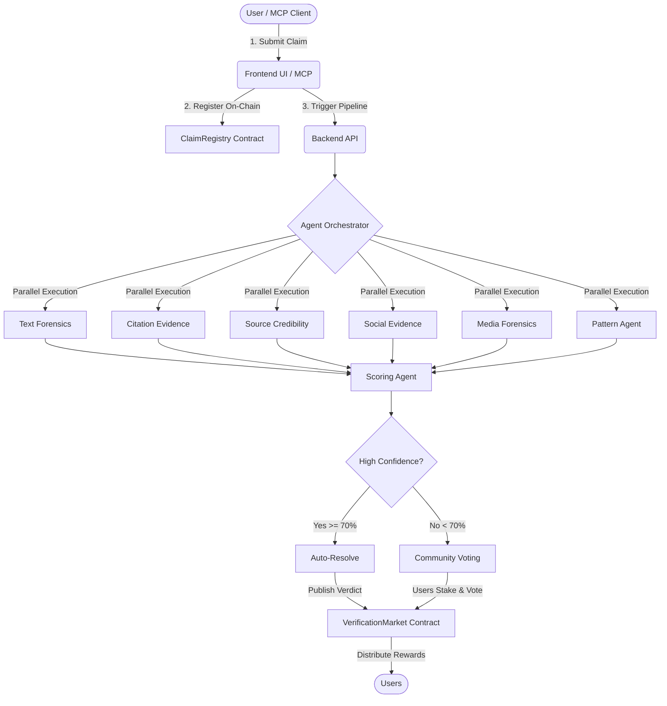
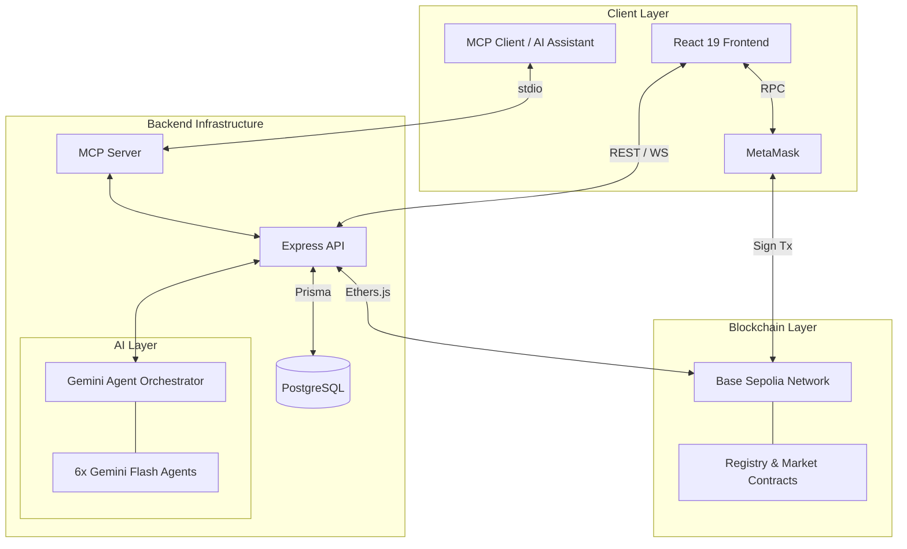

# VeriChain: Decentralized Claim Verification with Agentic AI & Community Consensus

[](https://opensource.org/licenses/MIT)
[](https://soliditylang.org/)
[](https://reactjs.org/)
[](https://www.typescriptlang.org/)

**A Decentralized, Agentic AI-Powered Misinformation Detection Platform on Base Sepolia**

VeriChain combines Gemini 2.0 Flash agentic AI with community-driven verification to create an immutable, decentralized database of verified information. Built on blockchain technology, it serves as a verification layer that platforms can query via API or Model Context Protocol (MCP) rather than being a standalone social platform.

## 🌟 Overview

VeriChain creates a decentralized verification protocol combining community consensus, economic incentives, and high-speed AI analysis to create a portable verification layer.

### The Problem
- **Verification Gap**: Misinformation spreads before fact-checking catches it. No universal trust mechanism exists across platforms.
- **Incentive Misalignment**: Fact-checkers aren't compensated. Platforms profit from engagement, not accuracy.
- **Fragmentation**: Every platform fact-checks independently, duplicating work and creating inconsistent trust models.

### The Solution
VeriChain creates a decentralized marketplace where a swarm of specialized Gemini 2.0 AI agents verifies claims and communities stake capital to vote on accuracy. 

## 🚀 How It Works


```mermaid
flowchart TD
    User([User / MCP Client]) -->|1. Submit Claim| FE(Frontend UI / MCP)
    FE -->|2. Register On-Chain| SC_CR[ClaimRegistry Contract]
    FE -->|3. Trigger Pipeline| API(Backend API)
    
    API --> ORCH{Agent Orchestrator}
    
    ORCH -->|Parallel Execution| AG1[Text Forensics]
    ORCH -->|Parallel Execution| AG2[Citation Evidence]
    ORCH -->|Parallel Execution| AG3[Source Credibility]
    ORCH -->|Parallel Execution| AG4[Social Evidence]
    ORCH -->|Parallel Execution| AG5[Media Forensics]
    ORCH -->|Parallel Execution| AG6[Pattern Agent]
    
    AG1 & AG2 & AG3 & AG4 & AG5 & AG6 --> SCORE[Scoring Agent]
    
    SCORE --> COND{High Confidence?}
    COND -->|Yes >= 70%| RESOLVE[Auto-Resolve]
    COND -->|No < 70%| VOTE[Community Voting]
    
    RESOLVE -->|Publish Verdict| SC_VM[VerificationMarket Contract]
    VOTE -->|Users Stake & Vote| SC_VM
    SC_VM -->|Distribute Rewards| Users([Users])
```

1. **Claim Submission**: Users submit claims on-chain via Web3 wallets.
2. **AI Swarm Analysis**: A synchronized swarm of Gemini 2.0 Flash agents analyzes claims (Text Forensics, Citations, Source Credibility, Social Evidence, Media Forensics, Pattern Recognition).
3. **Scoring & Routing**: An orchestrator calculates a weighted confidence score. High confidence verdicts are auto-resolved. Low confidence verdicts are routed to community voting.
4. **Community Voting**: Users stake ETH to vote TRUE/FALSE on uncertain claims.
5. **Reward Redistribution**: Correct voters receive their stake back plus a proportional cut of the losing side's pool.
6. **Immutable Record**: All verdicts are finalized on Base Sepolia, available for external systems to consume via our MCP Server.

## 🏗️ Architecture


```mermaid
graph TD
    subgraph Client Layer
        UI[React 19 Frontend]
        MCP[MCP Client / AI Assistant]
        Wallet[MetaMask]
    end

    subgraph Backend Infrastructure
        API[Express API]
        MCPServer[MCP Server]
        DB[(PostgreSQL)]
        
        subgraph AI Layer
            Orchestrator[Gemini Agent Orchestrator]
            Agents[6x Gemini Flash Agents]
            Orchestrator --- Agents
        end
    end

    subgraph Blockchain Layer
        Base[Base Sepolia Network]
        Contracts[Registry & Market Contracts]
        Base --- Contracts
    end

    UI <-->|REST / WS| API
    MCP <-->|stdio| MCPServer
    MCPServer <--> API
    UI <-->|RPC| Wallet
    Wallet <-->|Sign Tx| Base
    API <-->|Prisma| DB
    API <--> Orchestrator
    API <-->|Ethers.js| Base
```

### Smart Contracts (Base Sepolia)
- **ClaimRegistry**: Manages claims, UUID generation, and on-chain hashing.
- **VerificationMarket**: Handles ETH staking, voting, and proportional reward distribution.
- **Reputation & VerifierBadge**: Tracks user credibility and awards NFTs for top fact-checkers.

### Backend Infrastructure
- **Agent Orchestrator**: High-performance pipeline executing 6 Gemini Flash agents in parallel.
- **MCP Server**: Model Context Protocol implementation allowing AI assistants (like Claude) to natively query VeriChain verdicts and submit claims.
- **PostgreSQL / Prisma**: High-speed indexing and caching of claim data.
- **Dockerized**: Fully containerized environment for immediate spin-up.

### Frontend Application
- **React 19 & Vite**: Ultra-fast frontend build.
- **Wallet-Only Auth**: Strictly Web3 identity via MetaMask (no email/password forms).
- **Live Polling**: Real-time websocket-like polling for AI agent breakdowns.

## 🛠️ Setup & Installation

VeriChain uses Docker to seamlessly boot the database, backend, and frontend environments.

### Prerequisites
- Node.js (v20+)
- Docker & Docker Compose
- MetaMask wallet with Base Sepolia ETH
- Google Gemini API Key

### 1. Clone the Repository
```bash
git clone <repository-url>
cd veri-chain
```

### 2. Environment Configuration

Create `.env` files based on the provided examples.

**Backend (`backend/.env`)**:
```env
PORT=8080
DATABASE_URL=postgresql://verichain:verichain_dev@db:5432/verichain
GEMINI_API_KEY=your_gemini_api_key
RPC_URL=https://sepolia.base.org
PRIVATE_KEY=your_wallet_private_key
```

**Frontend (`frontend/.env`)**:
```env
VITE_API_BASE_URL=http://localhost:8080/api
VITE_CLAIM_REGISTRY_ADDRESS=0xeD67F63B90Af9c436B36A37f048f259568F05ac5
VITE_VERIFICATION_MARKET_ADDRESS=0xCa8f98130a054F7Ec42cf36416af9E4B892B0A28
```

### 3. Run Pre-flight Check
Verify your environment dependencies are correctly installed:
```bash
bash scripts/preflight-check.sh
```

### 4. Boot the Infrastructure
Use Docker Compose to launch the Database, Backend API, and Frontend UI:
```bash
# Start the database and run migrations
docker compose up -d db
docker compose run --rm backend npx prisma migrate dev --name init

# Start the full stack
docker compose up -d
```
- **Frontend**: Available at `http://localhost:5173`
- **Backend API**: Available at `http://localhost:8080`

## 🤖 MCP Server Integration

VeriChain includes a fully functional Model Context Protocol (MCP) server. This allows AI IDEs (like Cursor, Windsurf) or AI Assistants (like Claude Desktop) to natively interact with the decentralized fact-checking protocol.

**Available Tools:**
- `check_prior_verdicts`: Semantically search the VeriChain DB for previously verified claims.
- `submit_to_verichain`: Submit a new claim to the network and trigger the AI agent swarm.
- `get_claim_status`: Monitor the real-time status of a claim and read individual agent verdicts.

**To run the MCP server:**
```bash
cd backend
npm run mcp:dev
```
*Configure your MCP client to spawn this server via `stdio` using `npx tsx src/mcp/server.ts`.*

## 📁 Repository Structure

```
veri-chain/
├── backend/                  # Express API, MCP Server, Gemini Agent Swarm
│   ├── src/agents/           # Individual Gemini 2.0 Flash agents
│   ├── src/mcp/              # MCP server implementation
│   ├── src/routes/           # API endpoints
│   └── prisma/               # Database schema
├── frontend/                 # React 19 SPA
│   ├── src/pages/            # Wallet-only auth, live claims UI, voting UI
│   ├── src/components/       # Animated UI components
│   └── src/services/         # Contract interaction & API polling
├── web3/                     # Hardhat smart contract environment
│   ├── contracts/            # Solidity files (ClaimRegistry, VerificationMarket)
│   └── scripts/              # Base Sepolia deployment scripts
└── docker-compose.yml        # Infrastructure orchestration
```

## 📄 License
This project is licensed under the MIT License - see the [LICENSE](LICENSE) file for details.